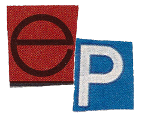
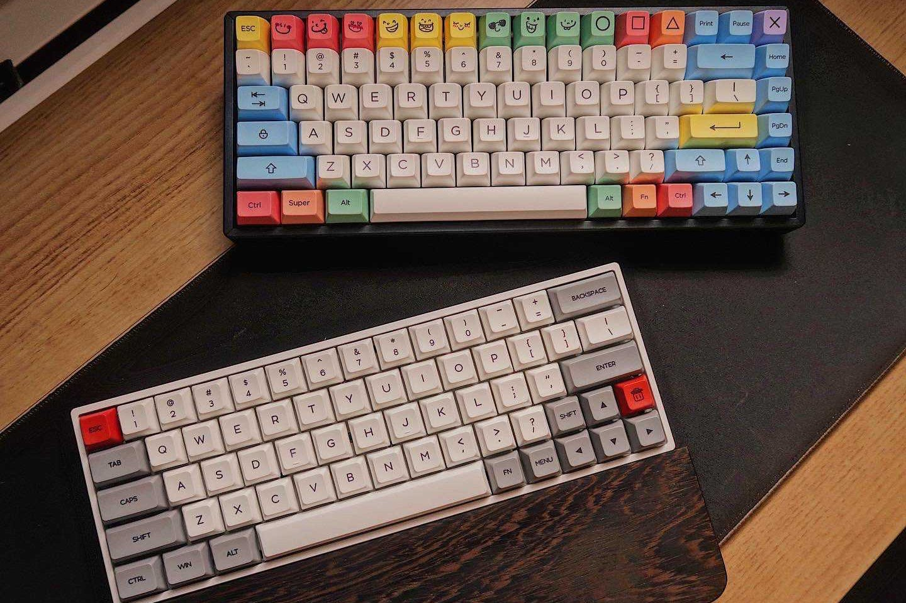
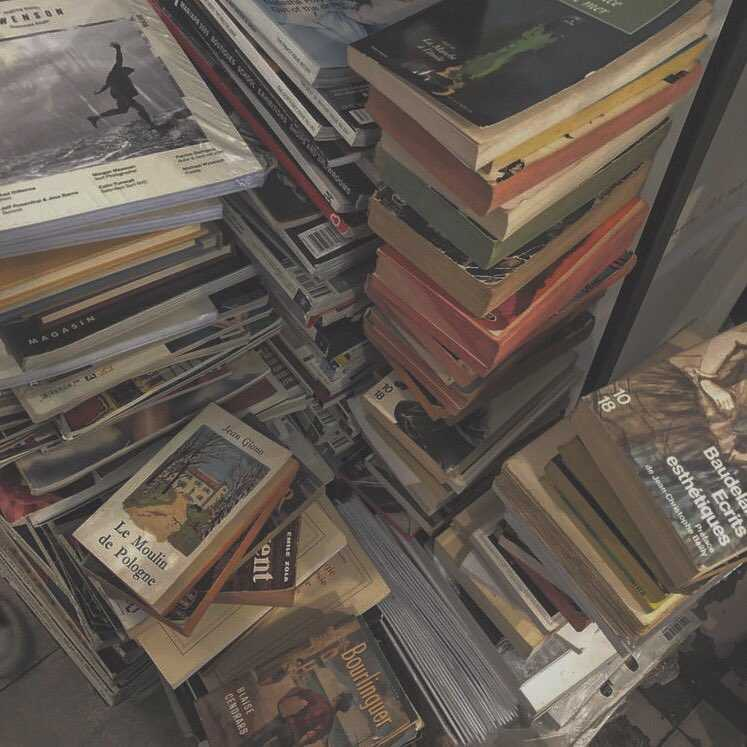

<!DOCTYPE html>
<html lang="en">
   <head>
      <!-- basic -->
      <meta charset="utf-8">
      <meta http-equiv="X-UA-Compatible" content="IE=edge">
      <meta name="viewport" content="width=device-width, initial-scale=1">
      <!-- mobile metas -->
      <meta name="viewport" content="width=device-width, initial-scale=1">
      <meta name="viewport" content="initial-scale=1, maximum-scale=1">
      <!-- site metas -->
      <title>Ekspresi Universal</title>
      <meta name="keywords" content="">
      <meta name="description" content="">
      <meta name="author" content="">
      <!-- bootstrap css -->
      <link rel="stylesheet" type="text/css" href="css/bootstrap.min.css">
      <!-- style css -->
      <link rel="stylesheet" type="text/css" href="css/style.css">
      <!-- Responsive-->
      <link rel="stylesheet" href="css/responsive.css">
      <!-- fevicon -->
      <link rel="icon" href="images/fevicon.png" type="image/gif" />
      <!-- Scrollbar Custom CSS -->
      <link rel="stylesheet" href="css/jquery.mCustomScrollbar.min.css">
      <!-- Tweaks for older IEs-->
      <link rel="stylesheet" href="https://netdna.bootstrapcdn.com/font-awesome/4.0.3/css/font-awesome.css">
      <!-- owl stylesheets --> 
      <link href="https://fonts.googleapis.com/css?family=Poppins:400,700&display=swap" rel="stylesheet">
      <link rel="stylesheet" href="css/owl.carousel.min.css">
      <link rel="stylesoeet" href="css/owl.theme.default.min.css">
      <link rel="stylesheet" href="https://cdnjs.cloudflare.com/ajax/libs/fancybox/2.1.5/jquery.fancybox.min.css" media="screen">
   </head>

   <body>
      <!--Header section-->
      

         

            

               

               

                  <ul>
                     
                  </ul>
               

               

                  

                     <a href="javascript:void(0)" class="closebtn" onclick="closeNav()">&times;</a>
                     

                        <a href="home.html">Home</a>
                        <a href="about.html">About</a>
                        <a href="writing.html">Writing</a>
                        <a href="contact.html">Contact</a>
                     

                  

                  
               

            

         

      

      <!-- header section end -->
      <!-- banner section start -->
      

         

            

               

                  

                     

                        

                           

                              <h1 class="banner_taital">Mahira Nurhaliza</h1>
                              
Mahasiswi Teknik Informatika Politeknik Negeri Bandung

                           

                           

                              
<a href="about.html">Get to know Me</a>

                           

                        

                        

                           

                        

                     

                  

                  

                     

                        

                           

                              <h1 class="banner_taital">Eksploitasi Pikiran</h1>
                              
Idemu terlalu dalam digali

                           

                           

                              
<a href="#">Baca</a>

                           

                        

                        

                           

                        

                     

                  

                  

                     

                        

                           

                              <h1 class="banner_taital">Setiap Hari Itu Sama</h1>
                              
Kriteria mengatakannya berbeda

                           

                           

                              
<a href="#">Baca</a>

                           

                        

                        

                           

                        

                     

                  

               

               <a class="carousel-control-prev" href="#main_slider" role="button" data-slide="prev">
               <i class="fa fa-arrow-left" aria-hidden="true"></i>
               </a>
               <a class="carousel-control-next" href="#main_slider" role="button" data-slide="next">
               <i class="fa fa-arrow-right" aria-hidden="true"></i>
               </a>
            

         

      

      <!-- banner section end -->
      
      <!-- providing section start -->
      

         

            <h1 class="services_taital">Coretan Kata</h1>
         

      

      

         

            <h2 class="clean_text">Ekspresi Universal</h2>
            
Loving words since a kid, always write "reading" as a hobby, and collecting all good sentence I've ever found, made me believe that I like poem weather i read it or i write it. 
               Having this page give me a space to write my questions, my thoughts, my stories into a form that I want.
               And I know it would be my public diary.
            

            
<a href="#">Get A Quote</a>

         

      

      <!-- providing section end -->

      <!-- Writing section start -->
      

         

            <h1 class="services_taital">Coretan Kata</h1>
            
--------

            

               

                  

                     

                        <h4 class="express_text">Rapalan Malam</h4>
                        
Ketika lelap dihadang oleh gelap

                        
<a href="#">See More</a>

                        

                     

                  

                  

                     

                        

                        <h4 class="express_text">Rintihan Pikiran</h4>
                        
Pertanyaan yang berharap dijawab secara gampang dan gamblang

                        
<a href="#">See More</a>

                     

                  

                  

                     

                        <h4 class="express_text">Kilas Cerita</h4>
                        
Kisah yang dipotret dalam kata

                        
<a href="#">See More</a>

                        

                     

                  

               

            

         

      

      <!-- services section end -->

      <!-- choose section start -->
      

         

            <h1 class="services_taital">title list</h1>
            

               

                  

                     

                        

                           <h4 class="number_text">01</h4>
                           <h4 class="trusted_text">Gumam Malam</h4>
                        

                        
Hal-hal yang mengenai lelap, dihadang oleh gelap

                     

                  

                  

                     

                        

                           <h4 class="number_text">02</h4>
                           <h4 class="trusted_text">Rintihan Pikiran</h4>
                        

                        
Pertanyaan yang berharap dijawab secara gampang dan gamblang

                     

                  

                  

                     

                        

                           <h4 class="number_text">03</h4>
                           <h4 class="trusted_text">Kilas Cerita</h4>
                        

                        
Cerita yang terpotret dalam kata

                     

                  

               

            

         

      

      <!-- choose section end -->
      <!-- testimonial section start -->
      

         

            <h1 class="testimonial_taital">My Reviews</h1>
            

               

                  

                     

                        

                           

                              

                                 
                              

                              

                                 
It is a long established fact that a reader will be distracted by the readable content of a page when looking at its layout. The point of using Lorem Ipsum is that

                                 <h4 class="joech_text">Aroma Karsa</h4>
                                 
Novel karya Dee lestari

                              

                           

                        

                     

                     

                        

                           

                              

                                 
                              

                              

                                 
It is a long established fact that a reader will be distracted by the readable content of a page when looking at its layout. The point of using Lorem Ipsum is that

                                 <h4 class="joech_text">Lucy</h4>
                                 
Film 

                              

                           

                        

                     

                     

                        

                           

                              

                                 
                              

                              

                                 
It is a long established fact that a reader will be distracted by the readable content of a page when looking at its layout. The point of using Lorem Ipsum is that

                                 <h4 class="joech_text">Joech</h4>
                                 
Customer

                              

                           

                        

                     

                  

                  <a class="carousel-control-prev" href="#my_slider" role="button" data-slide="prev">
                  <i class="fa fa-arrow-left" aria-hidden="true"></i>
                  </a>
                  <a class="carousel-control-next" href="#my_slider" role="button" data-slide="next">
                  <i class="fa fa-arrow-right" aria-hidden="true"></i>
                  </a>
               

            

         

      

      <!-- testimonial section end -->
      <!-- footer section start -->
      

         

            

               

                  <h2 class="useful_text">contact mee</h2>
                  
<a href="#">ms.lizaluxe@gmail.com</a>

               

               

                  <h2 class="useful_text">explore my things </h2>
                  

                     <ul>
                        <li class="active"><a href="index.html">Home</a></li>
                        <li><a href="about.html">About</a></li>
                        <li><a href="writing.html">Writing</a></li>
                     </ul>
                  

               

               
               

                  <h1 class="useful_text">Keep Update</h1>
                  <input type="text" class="Enter_text" placeholder="Enter Your Email" name="Enter Your Email">
                  
<a href="#">Subscribe</a>

               

            

            

               

                  
                  
                  
                  
               

            

         

      

      <!-- footer section end -->
      <!-- copyright section start -->
      

         

            
Copyright 2020 All Rights Reserved. Design by<a href="https://html.design"> Free  html Templates</a>

         

      

      <!-- copyright section end -->
      <!-- Javascript files-->
      
      
      
      
      
      <!-- sidebar -->
      
      
      <!-- javascript --> 
      
      
       
         
   </body>
</html>
